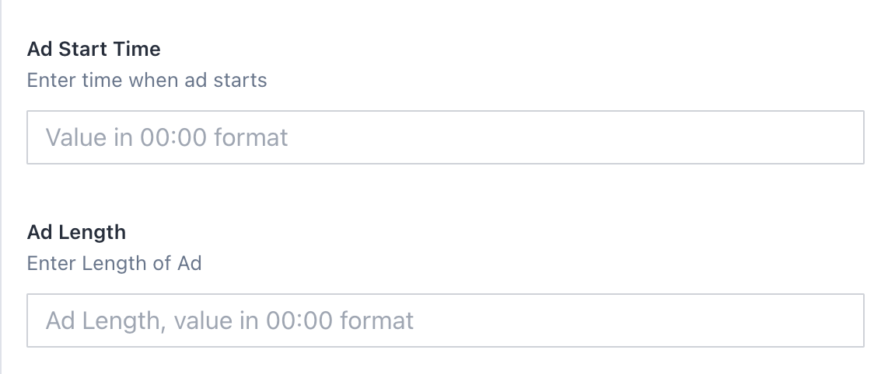
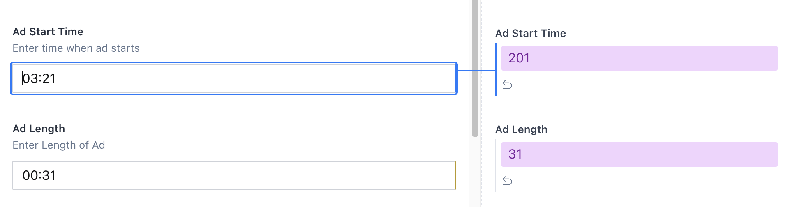

# sanity-plugin-time-seconds

For entering values in `mm:ss` format like `03:45`, and reflecting them in your sanity model as second numeric values. This input can be used to both reflect a time or a second length. The intention is to make it easier for CMS managers to input these values when referencing playback.

## Installation

```bash
sanity install time-seconds
```

Then you can use the `TimeToSecondsField` as an input component. Playback marker expects values in `mm:ss` format, and converts values to a seconds number whenever that criteria is met. The field type must always be "number".

## Configure

```typescript
import TimeToSecondsField from 'sanity-plugin-time-seconds'

{
  name: "timeSeconds", //Give your sanity field a name
  description: "Time when ad starts", //Give it a description
  type: "number", //Must always be number
  inputComponent: TimeToSecondsField,
  options: {
    placeholder: "Please enter a value in 00:00 format"
  }
}
```

# Screenshot

This is what the field looks like. On the right, the field's value is an int, representing seconds.

For fields in the schema like:
```javascript
{
  name: "adStartTime",
  title: "Ad Start Time",
  type: "number",
  inputComponent: TimeToSecondsField,
  description: "Enter time when ad starts",
  options: {
    placeholder: "Value in 00:00 format",
  },
},
{
  name: "adPlaybackLength",
  title: "Ad Length",
  type: "number",
  inputComponent: TimeToSecondsField,
  description: "Enter Length of Ad",
  options: {
    placeholder: "Value in 00:00 format",
  },
},
```
`TimeToSecondsField` represents it like:




with the value being stored as total seconds int.
